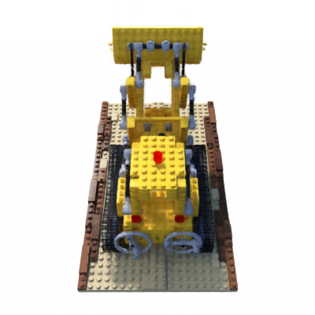
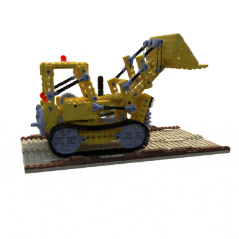
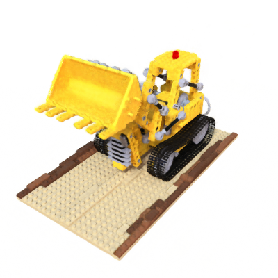
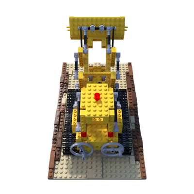

# NeRF-3D: Neural Radiance Field for 3D Reconstruction

A complete Neural Radiance Field (NeRF) implementation built from scratch in PyTorch, with an interactive Gradio web UI for 3D visualization and model export.

<p align="center">
  
  
  
</p>
<p align="center"><em>Novel views rendered from different angles (Lego scene, 200K training steps)</em></p>

---

## Overview

This project implements the classic NeRF pipeline from the paper [*NeRF: Representing Scenes as Neural Radiance Fields for View Synthesis*](https://arxiv.org/abs/2003.08934) (Mildenhall et al., 2020). Given a set of multi-view images with known camera poses, it trains a neural network to represent the 3D scene as a continuous volumetric function, then renders photorealistic novel views from arbitrary camera angles.

### Key Features

- **From-scratch implementation** -- no dependency on existing NeRF frameworks
- **Coarse + Fine architecture** with hierarchical volume sampling
- **Optimized for Apple Silicon** (MPS backend) -- runs on MacBook without NVIDIA GPU
- **Interactive Gradio UI** with orbit camera controls, 3D mesh viewer, and export
- **Full evaluation pipeline** with PSNR, SSIM, and LPIPS metrics
- **3D export** via marching cubes (OBJ/PLY/GLB mesh) and point cloud extraction
- **33 unit tests** covering all core components

## Architecture

```
Input: Multi-view images + camera poses
                    |
        +-----------+-----------+
        |                       |
   Ray Generation          Positional Encoding
   (pinhole camera)        (L=10 xyz, L=4 dir)
        |                       |
        +-----------+-----------+
                    |
        Stratified Sampling (64 coarse points)
                    |
            Coarse MLP (8 layers, 256 units)
                    |
            Volume Rendering --> coarse RGB
                    |
        Hierarchical Sampling (128 fine points)
                    |
             Fine MLP (8 layers, 256 units)
                    |
            Volume Rendering --> fine RGB
                    |
            Output: Novel view image
```

**MLP Architecture:**
- 8 fully-connected layers (256 hidden units, ReLU)
- Skip connection at layer 4
- Density head: sigma (1 output)
- Color head: direction-dependent RGB (3 outputs, sigmoid)
- ~596K parameters per network (coarse + fine = ~1.2M total)

## Results

Trained on the **Lego** scene from the NeRF Synthetic (Blender) dataset at 400x400 resolution.

| Metric | Value |
|--------|-------|
| **PSNR** | 28.28 dB |
| **SSIM** | 0.9271 |
| Training steps | 200,000 |
| Training time | ~20h on Apple M-series |

<p align="center">
  
  
</p>
<p align="center"><em>Left: Ground truth | Right: NeRF prediction</em></p>

## Project Structure

```
NeRF-3D/
├── config/default.py              # Hyperparameters (dataclass)
├── model/
│   ├── positional_encoding.py     # Sinusoidal encoding
│   ├── nerf_mlp.py                # Coarse + Fine MLP
│   └── renderer.py                # Volumetric rendering + hierarchical sampling
├── data/
│   ├── download.py                # Auto-download NeRF Synthetic dataset
│   ├── dataset.py                 # PyTorch Dataset with ray precomputation
│   └── ray_utils.py               # Camera math, ray generation
├── training/
│   ├── trainer.py                 # Training loop (MPS-optimized)
│   ├── losses.py                  # MSE loss (coarse + fine)
│   └── metrics.py                 # PSNR, SSIM, LPIPS
├── export/
│   ├── mesh_export.py             # Marching cubes -> OBJ/PLY/GLB
│   └── pointcloud_export.py       # Density threshold -> colored PLY
├── app/
│   ├── gradio_app.py              # 3-tab Gradio web UI
│   └── render_utils.py            # Orbit camera, turntable video
├── scripts/
│   ├── train.py                   # CLI: train
│   ├── evaluate.py                # CLI: compute test metrics
│   ├── export_mesh.py             # CLI: export 3D mesh/pointcloud
│   └── launch_app.py              # CLI: launch Gradio viewer
└── tests/                         # 33 unit tests
```

## Quick Start

### 1. Setup

```bash
python3 -m venv .venv
source .venv/bin/activate
pip install -r requirements.txt
```

### 2. Train

The dataset (NeRF Synthetic, ~1.3GB) downloads automatically on first run.

```bash
# Train on the Lego scene
PYTORCH_ENABLE_MPS_FALLBACK=1 python scripts/train.py --scene lego

# Available scenes: chair, drums, ficus, hotdog, lego, materials, mic, ship
```

Training options:
```bash
python scripts/train.py \
  --scene lego \
  --batch_size 1024 \
  --num_iterations 200000 \
  --img_size 400 \
  --lr 5e-4
```

Resume from a checkpoint:
```bash
python scripts/train.py --scene lego --resume checkpoints/ckpt_090000.pt
```

### 3. Evaluate

```bash
python scripts/evaluate.py --checkpoint checkpoints/ckpt_200000.pt --scene lego
```

### 4. Launch the Web Viewer

```bash
PYTORCH_ENABLE_MPS_FALLBACK=1 python scripts/launch_app.py \
  --checkpoint checkpoints/ckpt_200000.pt
```

Then open **http://localhost:7860** in your browser.

The viewer has 3 tabs:
- **Novel View** -- Render from any angle using orbit camera sliders
- **3D Model** -- Generate and interact with a 3D mesh (rotate, zoom)
- **Export** -- Download OBJ mesh, PLY point cloud, or 360 turntable video

### 5. Export 3D Models

```bash
# Export mesh (OBJ)
python scripts/export_mesh.py --checkpoint checkpoints/ckpt_200000.pt --format obj

# Export point cloud (PLY)
python scripts/export_mesh.py --checkpoint checkpoints/ckpt_200000.pt --type pointcloud
```

## Technical Details

### MPS (Apple Silicon) Optimizations

Since this project targets Apple Silicon Macs without NVIDIA GPUs:

- **Chunked network evaluation** (32K points per forward pass) to manage unified memory
- **Conservative batch size** (1024 rays) for 16GB unified memory
- **Periodic MPS cache clearing** (`torch.mps.empty_cache()`) to prevent fragmentation
- **`num_workers=0`** and **`pin_memory=False`** (no benefit with unified memory)
- **`PYTORCH_ENABLE_MPS_FALLBACK=1`** for unsupported MPS operations

### Rendering Pipeline

1. **Stratified sampling**: 64 uniform samples along each ray between near/far planes
2. **Coarse evaluation**: Query the coarse MLP at sample points, volume render to get weights
3. **Hierarchical sampling**: 128 additional samples concentrated where coarse weights are high (inverse CDF sampling)
4. **Fine evaluation**: Query the fine MLP at all 192 combined samples, volume render final RGB
5. **Alpha compositing**: `C(r) = sum_i T_i * alpha_i * c_i` with white background

### Dataset

Uses the [NeRF Synthetic (Blender)](https://github.com/bmild/nerf) dataset:
- 8 scenes with 100 train / 100 val / 200 test views each
- 800x800 RGBA images (downscaled to 400x400 for MPS training)
- Known camera intrinsics and extrinsics (camera-to-world transforms)
- Auto-downloaded from Hugging Face on first training run

## Running Tests

```bash
pip install pytest
python -m pytest tests/ -v
```

All 33 tests cover: positional encoding dimensions, ray generation math, MLP forward pass shapes, volumetric rendering correctness, and dataset loading.

## Requirements

- Python 3.10+
- PyTorch 2.1+ (with MPS support for Apple Silicon)
- See [requirements.txt](requirements.txt) for full list

## References

- [NeRF: Representing Scenes as Neural Radiance Fields for View Synthesis](https://arxiv.org/abs/2003.08934) (Mildenhall et al., ECCV 2020)
- [NeRF Synthetic Dataset](https://github.com/bmild/nerf)

## License

MIT
